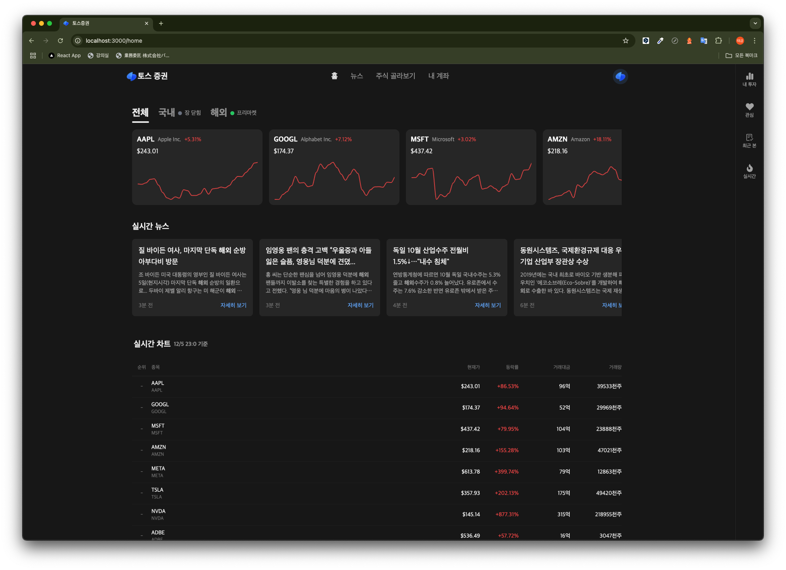
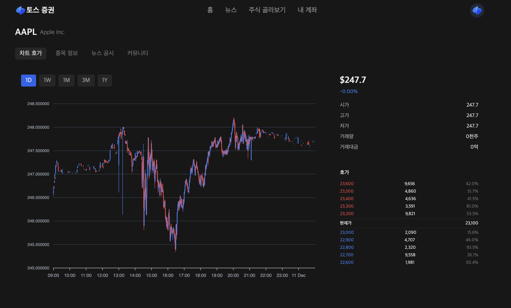
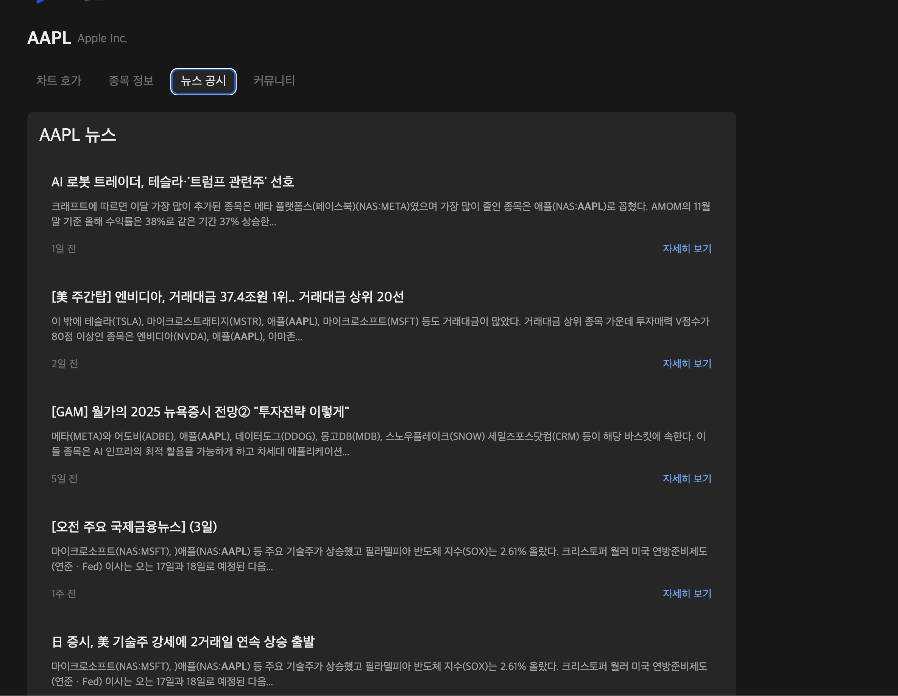
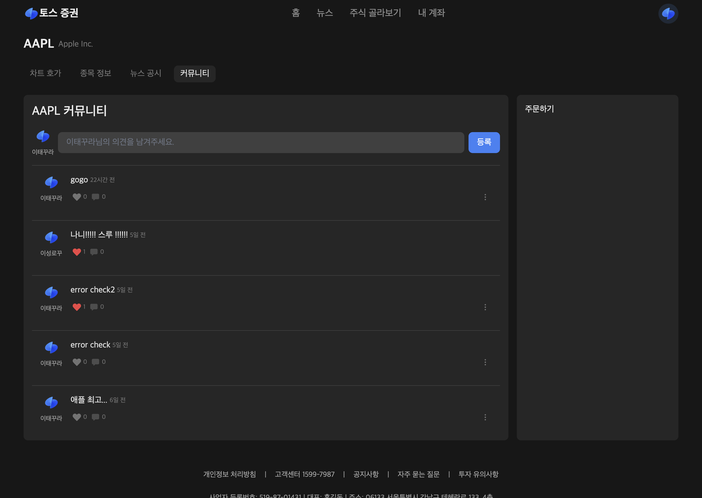

# 토스증권 클론 프로젝트





실시간 주식 정보와 뉴스를 제공하는 토스증권 클론 웹 애플리케이션입니다.

## 주요 기능

- 실시간 주식 정보 조회
- 국내/해외 주식 시세 확인
- 실시간 뉴스 피드
- 종목별 상세 정보
- 커뮤니티 기능 (댓글, 좋아요)
- 반응형 디자인

## 기술 스택

### Frontend

- Next.js 14 (App Router)
- TypeScript
- Tailwind CSS
- Framer Motion
- SWR
- Zustand

### Backend

- Next.js API Routes
- Prisma
- SQLite

### API

- Polygon.io (주식 데이터)
- Naver News API

## 시작하기

1. 저장소 클론

```bash
git clone https://
```

2. 의존성 설치

```bash
npm install
```

3. 환경 변수 설정

```bash
cp .env.example .env
```

필요한 API 키와 환경 변수를 설정해주세요.

4. 데이터베이스 설정

```bash
npx prisma migrate dev
```

5. 개발 서버 실행

```bash
npm run dev
```

## 환경 변수

```env
DATABASE_URL="file:./database.db"
POLYGON_API_KEY="your_polygon_api_key"
NAVER_CLIENT_ID="your_naver_client_id"
NAVER_CLIENT_SECRET="your_naver_client_secret"
```

## 프로젝트 구조

```
├── app/                 # Next.js 앱 라우터
├── components/          # 재사용 가능한 컴포넌트
├── hooks/              # 커스텀 훅
├── lib/                # 유틸리티 함수
├── prisma/             # Prisma 스키마 및 마이그레이션
├── public/             # 정적 파일
├── store/              # 상태 관리
└── types/              # TypeScript 타입 정의
```

## 라이선스

MIT License

## 기여하기

1. Fork the Project
2. Create your Feature Branch (`git checkout -b feature/AmazingFeature`)
3. Commit your Changes (`git commit -m 'Add some AmazingFeature'`)
4. Push to the Branch (`git push origin feature/AmazingFeature`)
5. Open a Pull Request
