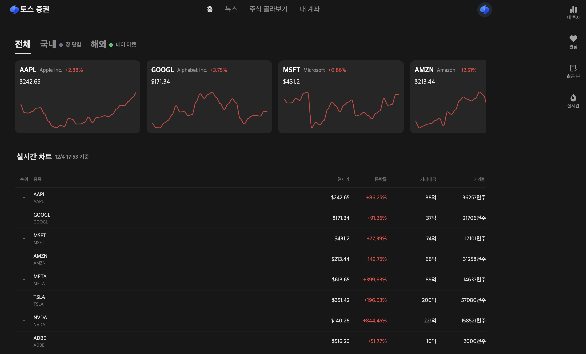

# 실시간 주식 모니터링 대시보드


실시간으로 국내외 주식 시장을 모니터링할 수 있는 웹 애플리케이션입니다.

## 주요 기능

- 실시간 주가 모니터링
- 국내/해외 주식 시장 구분
- 차트 기반 시각화
- 반응형 디자인
- 드래그 가능한 차트 인터페이스
- 스켈레톤 로딩 UI
- 사용자 인증 (로그인/회원가입)
- 실시간 시장 상태 표시
- 종목별 상세 정보 제공

## 기술 스택

### Frontend

- Next.js 14 (App Router)
- TypeScript
- TailwindCSS
- Framer Motion
- ApexCharts

### 상태 관리

- React Hooks
- SWR

### 개발 도구

- ESLint
- Prettier
- PostCSS
- Zod (유효성 검사)

## 시작하기

### 필수 요구사항

- Node.js 18.0.0 이상
- npm 또는 yarn
- Polygon.io API 키

### 환경 변수 설정

## 프로젝트 구조

### 설치 방법

1. 저장소 클론

   ```bash
   git clone https://github.com/yourusername/stock-monitoring-dashboard.git
   ```

2. 의존성 설치
   npm install

3. 개발 서버 실행
   npm run dev

4. http://localhost:3000 접속

## API 엔드포인트

### 주식 데이터

- GET `/api/stock/getStocks` - 여러 종목의 주식 데이터 조회
- GET `/api/stock/[ticker]` - 특정 종목의 상세 데이터 조회

### 사용자 인증

- POST `/api/auth/login` - 로그인
- POST `/api/auth/register` - 회원가입
- POST `/api/auth/logout` - 로그아웃

## 라이선스

MIT License
